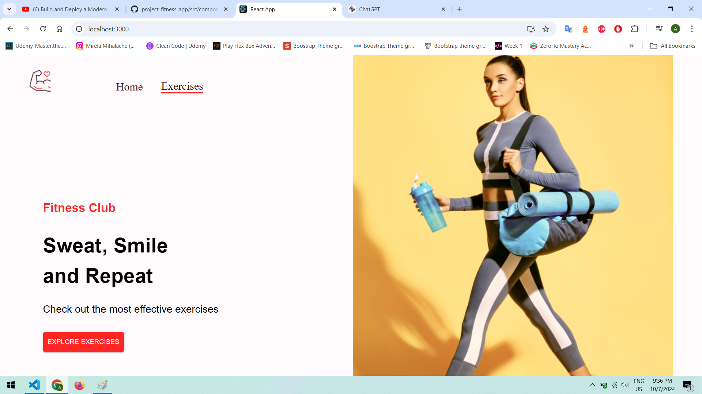
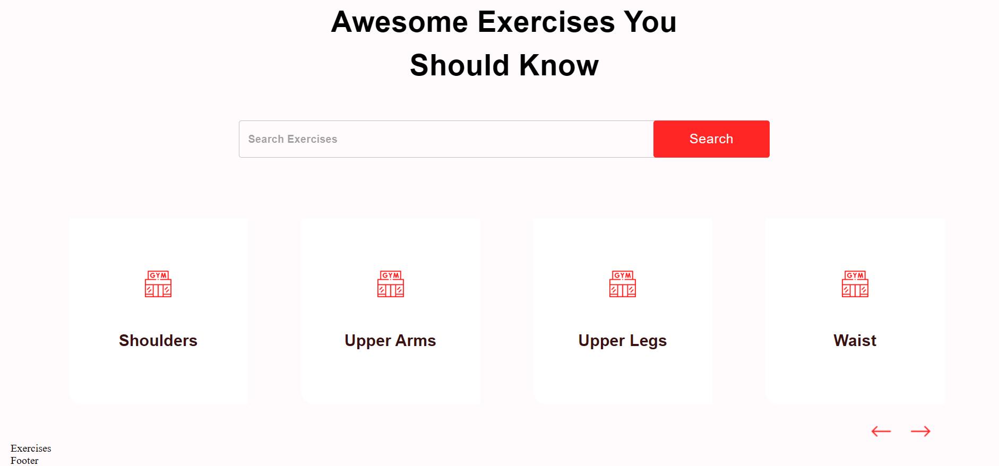

# 🏋️ React Fitness Application

React Fitness Application is a modern app built with **React** that allows users to search for exercises, view muscle group details, and plan workouts.

## 🚀 [Live Site - Click Here](https://fitness-exercises-five.vercel.app/)

---

## ⚙️ Features

- 🔍 **Exercise Search** - Filter by muscle groups, equipment, and types of exercises.
- 📊 **Exercise Details** - Information on muscles and required equipment.
- 💪 **Workout Planning** - Create and track your workouts.

🔧 Technologies Used
React 🛠️ - Core framework for building the application.
Material UI 🎨 - For designing interactive and visually appealing components.
ExerciseDB API 💾 - Database providing detailed exercise information.

🙏 Acknowledgements
A big thank you to the amazing tutorials from [JavaScript Mastery](https://www.youtube.com/watch?v=KBpoBc98BwM&t=4584s), which greatly helped in the development of this project.

